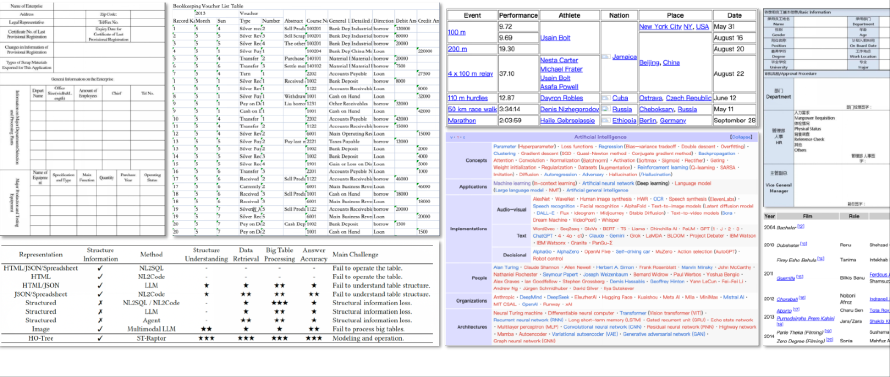
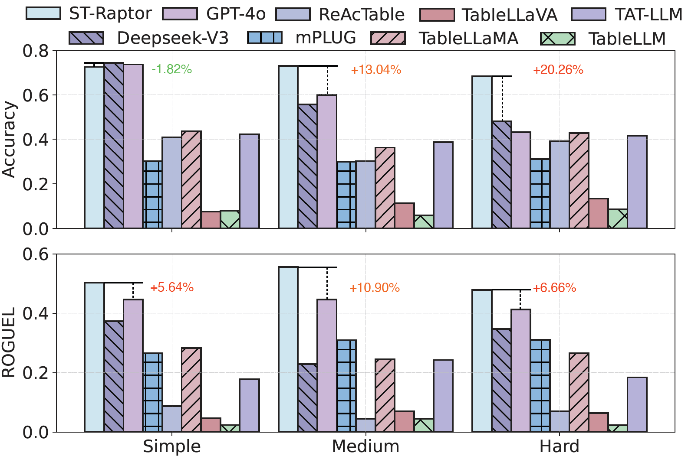

# ST-Raptor

<p align="center">
  
</p>


## ✨ Project Introduction

**ST-Raptor** is a tool for answering questions over Excel tables with diverse layouts. It takes only an Excel-formatted table and a natural language question as input, and produces precise answers.

Unlike many existing approaches, ST-Raptor requires no additional fine-tuning. It combines a vision-language model (VLM) with a tree-construction algorithm (HO-Tree) and flexibly integrates with different LLMs. ST-Raptor employs a two-stage validation mechanism to ensure reliable results.

## ❓ What Tables Can ST-Raptor Handle?

<p align="center">
  
</p>

**Semi-structures tables like personal information form, academic tables, financial tables... from Excel, websites (HTML), Markdown, csv files...**

## 💻 SSTQA Benchmark

The **102** tables and **764** questions in SSTQA are carefully curated from over **2031** real-world tables by considering $(i)$ tables featuring semi-structured formats, such as nested cells, multi-row/column headers, irregular layouts and $(ii)$ coverage across **19** representative real scenarios.

We list out 10 representative real scenarios as below:

Human Resources, Corporate Management, Financial Management, Marketing, Warehouse Management, Academic, Schedule Management, Application Forms, Education-related, and Sales Management.

Download the unfiltered dataset with 2k+ tables: [Raw Dataset]().

Download the SSTQA benchmark: [SSTQA Benchmark](https://drive.google.com/file/d/1LkdxJHJfThNUiEh68YdgkN_eNbJEoRJ7/view?usp=sharing).


## 📊 Performance

The following table demonstrates the answering accuracy (%) and ROUGE-L score of different methods over our collected SSTQA benchmark and other two benchmarks.

Note that the required question answering is highly dependent on both the semi-structured table complexity and the question complexity.

## Baselines

NL2SQL methods: [OpenSearch-SQL](https://github.com/OpenSearch-AI/OpenSearch-SQL)

Fine-tuning based methods: [TableLLaMA](https://github.com/OSU-NLP-Group/TableLlama) [TableLLM](https://github.com/RUCKBReasoning/TableLLM)

Agent based methods: [ReAcTable](https://github.com/yunjiazhang/ReAcTable) [TAT-LLM](https://github.com/fengbinzhu/TAT-LLM)

Vision Language Model based methods: [TableLLaVA](https://huggingface.co/SpursgoZmy/table-llava-v1.5-13b) [mPLUG-DocOwl1.5](https://huggingface.co/mPLUG/DocOwl1.5)

Foudation Models: [GPT-4o](https://openai.com/index/gpt-4/) [DeepSeekV3](https://www.deepseek.com/)

## Experiment Results

| **Method**               | WikiTQ-ST        | TempTabQA-ST     |      SSTQA       |      SSTQA      |
| ------------------------ | ---------------- | ---------------- | :--------------: | :-------------: |
|                          | **Accuracy (%)** | **Accuracy (%)** | **Accuracy (%)** | **ROUGE-L (%)** |
| **NL2SQL (200 Samples)** |                  |                  |                  |                 |
| OpenSearch-SQL           | 38.89            | 4.76             |      24.00       |      23.87      |
| **Fine-tuning based**    |                  |                  |                  |                 |
| TableLLaMA               | 35.01            | 32.70            |      40.39       |      26.71      |
| TableLLM                 | 62.40            | 9.13             |       7.84       |      2.93       |
| **Agent based**          |                  |                  |                  |                 |
| ReAcTable                | 68.00            | 35.88            |      37.24       |      7.49       |
| TAT-LLM                  | 23.32            | 61.86            |      39.78       |      19.26      |
| **VLM based**            |                  |                  |                  |                 |
| TableLLaVA               | 20.41            | 6.91             |       9.52       |      5.92       |
| mPLUG-DocOwl1.5          | 39.80            | 39.80            |      29.56       |      28.43      |
| **Foundation Model**     |                  |                  |                  |                 |
| GPT-4o                   | 60.71            | 74.83            |      62.12       |      43.86      |
| DeepSeekV3               | 69.64            | 63.81            |      62.16       |      46.17      |
| **ST-Raptor**            | **71.17**        | **77.59**        |    **72.39**     |    **52.19**    |

<p align="center">
  
</p>

## 🕹 Quick Start

#### 1. Clone Repository

```shell
git clone git@github.com:weAIDB/ST-Raptor.git
cd ST-Raptor
```

##### Please download this repository.

#### 2. Environment & Benchmark & Model

**Environment.**

1. Use the following command to install the conda environment.

```bash
# create virtual environment
conda create -n straptor python=3.10
conda activate straptor
# install required packages
pip install -m requirements.txt
```

2. Install the HTML rendering plugin wkhtmltox.

```shell
wget https://github.com/wkhtmltopdf/packaging/releases/download/0.12.6.1-2/wkhtmltox_0.12.6.1-2.jammy_amd64.deb
sudo apt install -f ./wkhtmltox_0.12.6.1-2.jammy_amd64.deb
```

**Benchmark**

1. Download the SSTQA with the link [SSTQA Benchmark](https://drive.google.com/file/d/1LkdxJHJfThNUiEh68YdgkN_eNbJEoRJ7/view?usp=sharing) and save in ./data

2. Change the settings in ./main.py

```python
# You need to change this
input_jsonl = 'PATH_TO_YOUR_INPUT_JSONL'
table_dir = 'PATH_TO_YOUR_TABLE_DIR'
output_jsonl = 'PATH_TO_YOUR_OUTPUT_JSONL'
log_dir = 'PATH_TO_YOUR_LOG_DIR'
```

The Q&A data is stored in a JSONL format file, and the format of each record is as follows.
```json
{
	"id": "XXX", 
	"table_id": "XXX", 
	"query": "XXX", 
	"label": "XXX"
}
```

**Model Configuration.**
The model configuration in our paper includes Deepseek-V3 (LLM API) + InternVL2.5 26B (VLM) + Multilingual-E5-Large-Instruct (Embedding Model). This configuration requires a total of approximately 160GB of GPU memory. You can replace the model according to the hardware situation or change it to use APIs.

[Download InternVL2.5](https://huggingface.co/OpenGVLab/InternVL2_5-26B) [Download Multilingual-E5](https://huggingface.co/intfloat/multilingual-e5-large-instruct)

You need to set model configuration in /utils/constnts.py

```python
# Set your LLM api
API_URL = "YOUR_LLM_API_URL"
API_KEY = "YOUR_LLM_API_KEY"

# If you use local deployed LLM, set this
LLM_PORT = YOUR_LLM_PORT
LLM_MODEL_TYPE = YOUR_LLM_MODEL_NAME

# Set your local deployed VLM api, we use vllm as default
VLM_PORT = YOUR_VLM_PORT
VLM_MODEL_TYPE = YOUR_VLM_MODEL_NAME

# Your model path to MUltilingual-E5 model
MULTILINGUAL_E5_MODEL_PATH = "YOUR_MODEL_PATH"
```

If you want to use other format of apis, please revise the code in ./utils/api_utils.py

**InternVL2.5 Deployment**

We use vLLM to deploy InternVL2.5 as an example.

1. Install the vllm package.

```shell
pip install vllm
```

2. Denote the GPU and deploy the VLM.

```shell
CUDA_VISIBLE_DEVICES=0,1,2,3 python -m vllm.entrypoints.openai.api_server \
--model=PATH_TO_INTERNVL \
--port 8138 \
--trust-remote-code \
--max-num-batched-tokens 8192 \
--seed 42 \
--tensor-parallel-size 4
```

#### Question Answering !

If you have completed all the above settings, use the following command to start execution

```shell
python ./main.py
```

## 💡 Semi-Structured Table QA Examples

|                           Question                           | Ground Truth                                                 | TableLLaMA                                                   | TableLLM                                                     | ReAcTable                                                    | TAT-LLM                                                      | TableLLaVA                                                   | mPLUG-DocOwl1.5                                              | DeepseekV3                                                   | GPT-4o                                                       | ST-Raptor                                                    |
| :----------------------------------------------------------: | ------------------------------------------------------------ | ------------------------------------------------------------ | ------------------------------------------------------------ | ------------------------------------------------------------ | ------------------------------------------------------------ | ------------------------------------------------------------ | ------------------------------------------------------------ | ------------------------------------------------------------ | ------------------------------------------------------------ | ------------------------------------------------------------ |
| What is the value of the employment service satisfaction indicator in the overall budget performance target table for municipal departments in 2024? | ≧90%                                                         | 75.0                                                         | 737                                                          | ≧95%                                                         | ≧90%                                                         | 80%                                                          | ≧90%                                                         | ≧90%                                                         | ≧90%                                                         | ≧90%                                                         |
|   How many items are there in the drawing specifications?    | 15                                                           | 2                                                            | To change the template, you can follow these steps: ...      | 7                                                            | 108                                                          | 17                                                           | 4                                                            | 15                                                           | 23                                                           | 15                                                           |
|  How many status codes are there in the status code table?   | 3                                                            | 3                                                            | To change the template, you can follow these steps: ...      | 7                                                            | 5                                                            | 33                                                           | 3                                                            | 3                                                            | 4                                                            | 3                                                            |
|       Which month had the lowest expenditure in 2020?        | February                                                     | Travel expenses                                              | To find the total expenditure amount in June 2019 ...        | June 5th                                                     | ""                                                           | June 5th                                                     | Long Boat Festival welfare                                   | February                                                     | January                                                      | February                                                     |
| How many sales records did the brand "Tengyuan Mingju" have in June? | 7                                                            | 3                                                            | ""                                                           | 7                                                            | ""                                                           | 13                                                           | 5                                                            | 7                                                            | 8                                                            | 7                                                            |
| What was the business hospitality expense of the Comprehensive Management Office in February? | 5106.36                                                      | 5106.36                                                      | ""                                                           | ""                                                           | SELECT SUM(`Amount incurred`) FROM DF WHERE `Project Content` = 'Business entertainment expenses' ... | 3500                                                         | 130,168                                                      | 5106.36                                                      | 5106.36                                                      | 5106.36                                                      |
| What is the proposed funding for the social insurance gap and living allowance for college graduates under the \"Three Supports and One Assistance\" program? | 587.81 million yuan                                          | 587.81                                                       | To find the number of financially supported personnel ...    | To find the proposed investment amount for the social insurance gap and living allowance ... | 587.81                                                       | 1.2 billion                                                  | 1140                                                         | 587.81                                                       | 587.81                                                       | 587.81                                                       |
| What is the target value for the number of new urban employment in the 2024 Municipal Department Overall Budget Performance Target Table? | 50000 people                                                 | 50000                                                        | To find the number of financially supported personnel in...  | The question asks for the indicator value for the number of new urban employment ... | 50000                                                        | 1484                                                         | 50000                                                        | 50000                                                        | 50000                                                        | 50000                                                        |
| How many first-level indicators are there in the performance metrics? | 3                                                            | 10                                                           | 10                                                           | 10                                                           | 10                                                           | 100                                                          | 2                                                            | 3                                                            | 4                                                            | 3                                                            |
| How many third-level indicators are there in the quantity indicators of the performance metrics? | 4                                                            | 2                                                            | To change the template, you can follow these steps: ...      | To determine how many information items in the information item comparison... | 12#13#14#15#16#17#18#19#20#21#22#23#24#25#26#27#28#29#30...  | 108                                                          | 4                                                            | 8                                                            | 3                                                            | 8                                                            |
| How many points are deducted each time for disciplinary violations? | 0.5                                                          | 0.5                                                          | 0.5                                                          | 0.5                                                          | 0.5 points                                                   | For each violation of discipline, 10% of the employee's base salary will be deducted. | 0.5 points                                                   | 0.5                                                          | 0.5                                                          | 0.5                                                          |
| How many evaluation items are there for technical management in the key performance review indicators? | 9                                                            | 15                                                           | The item with the highest standard score in the basic performance evaluation indicators is  ... | 7                                                            | 16                                                           | 10                                                           | 4                                                            | 0                                                            | 10                                                           | 0                                                            |
| Has the fire safety approval process been completed for the area covered by this tender? | Already registered, provided                                 | already applied for and provided                             | completed for the bidding area                               | The item with the highest standard score in the basic performance... | ""                                                           | The fire protection application procedure has been completed for the bidding area. | Yes                                                          | Construction reported and provided                           | The fire protection application has been completed.          | Construction reported, provided                              |
| How many responsible departments are involved at the construction site? | 1                                                            | 2                                                            | To determine the employee with the longest tenure in the table, ... | 10                                                           | 11                                                           | 22                                                           | 2                                                            | 1                                                            | 1                                                            | 1                                                            |
|     What is the total financial expense for all months?      | 1312                                                         | 6500                                                         | 5635559.66                                                   | ""                                                           | 64800.0                                                      | 4300000                                                      | 5502                                                         | 1412                                                         | 1412                                                         | 1412                                                         |
| Who is responsible for sealing the reserved holes and sleeves of fire protection facilities and equipment? | winning bidder                                               | winning bidder                                               | ""                                                           | To answer the question \"Who is responsible for sealing the reserved ... | ""                                                           | fire department                                              | the manufacturer                                             | winning bidder                                               | The winning bidder is responsible.                           | winning bidder                                               |
|     Which two products had sales exceeding 3800 in June?     | Potato chips, Soy milk                                       | Potato chips, Soy milk                                       | To find the sales volume of soy milk in June, we             | SQL: ```SELECT `product name`, June FROM DF WHERE June > 3800;```.... | Potato chips                                                 | In June, the sales of the two products were 3800 and 4200.   | Potato chips, Soy milk                                       | Potato chips, Soy milk                                       | Potato chips, Soy milk                                       | Potato chips, Soy milk                                       |
| How many times is the sales volume of soy milk in May compared to the sales volume of potato chips in May? | 1.32                                                         | 2.06667                                                      | 5000                                                         | 1.32                                                         | 0.27778                                                      | 1.046154                                                     | 2.2                                                          | 1.32                                                         | 1.32                                                         | 1.32                                                         |
| How much did the sales volume of glucose increase in February compared to January? | 350                                                          | 1150                                                         | 5000                                                         | 350                                                          | 350                                                          | 2300                                                         | 100                                                          | 350                                                          | 350                                                          | 350                                                          |
| Which month has the highest sales volume of nutritious oat cereal? | June                                                         | May                                                          | June                                                         | June                                                         | June                                                         | March                                                        | June                                                         | June                                                         | June                                                         | June                                                         |
|        What was the sales volume of soy milk in June?        | 5000                                                         | 5000                                                         | 5000                                                         | 5000                                                         | 5000                                                         | 1150                                                         | 5000                                                         | 5000                                                         | 5000                                                         | 5000                                                         |
|      How many items are there in the specific project?       | 10                                                           | 1                                                            | The specific contents of determining the cost calculation object... | 1                                                            | 10                                                           | 19                                                           | 10                                                           | 10                                                           | 12                                                           | 10                                                           |
| What is the description for the "Reported" status in the status code table? | Change coordination, review feasibility by the Change Advisory Board. | The Change Coordination Change Advisory Committee conducts a feasibility review. | To change the template, you can follow these steps:          | The table provided does not contain any information about the "declared" status in the change status code table. | The Change Coordination Change Advisory Committee conducts a feasibility review. | The "declared" status is used to indicate that a change has been declared but not yet implemented. | The Change Coordination Advisory Committee conducts a feasibility review. | Change coordination Change Advisory Board conducts feasibility review. | Change coordination Change Advisory Board conducts feasibility review. | Change coordination Change Advisory Board conducts feasibility review. |
| What is the description related to information security requirements in the table of change reasons? | Information security related management is required          | Information security related management needs                | To change the template, you can refer to the "Change Template" row in the table. | ""                                                           | Information security related management needs                | The change reason table includes information security needs, which are related to the change request. | Information security relates to the management needs         | Information security related management requirements         | Information security related management requirements         | Information security related management requirements         |
|        What was the sales volume of glucose in March?        | 1150                                                         | 1150                                                         | 5000                                                         | 1150                                                         | 1150                                                         | 1800                                                         | 1150                                                         | 1150                                                         | 1150                                                         | 1150                                                         |
|    What is the number of new urban employment positions?     | 12，790，000 people                                          | 1279.0                                                       | 1279                                                         | 1279                                                         | 1279                                                         | 1000 people                                                  | 1279                                                         | 1279                                                         | 12,79 million people                                         | 1279                                                         |
| How many entries are there in the table of reasons for change? | 10                                                           | 3                                                            | To change the template, you can follow these steps: ...      | To determine how many reasons in the change reason table involve business... | 3                                                            | 10                                                           | 4                                                            | 1                                                            | 10                                                           | 1                                                            |
|  How many phases are there in the change phase code table?   | 6                                                            | 4                                                            | To change the template, you can follow these steps ...       | 55                                                           | 5                                                            | 17                                                           | 4                                                            | 6                                                            | 6                                                            | 6                                                            |
| What is the description of the change closure phase in the change phase code table? | Change closed and archived                                   | Change closure phase is the last phase of the change management process | To change the template, you can follow these steps:          | The table provided does not contain any information about the "change closure phase" or its description. | Change closure and archiving                                 | The change closure phase is a change phase that is used to indicate that the change has been completed | Change closure and archiving                                 | Change closed and archived                                   | Change closed and archived                                   | Change closed and archived                                   |
| How many more participants are enrolled in the basic old-age insurance for urban and rural residents than in the basic old-age insurance for urban employees at the end of the period? | 9745.25 million people                                       | 53046.1618                                                   | 1279                                                         | 9745.2486                                                    | 9745.2486                                                    | 10000                                                        | 200000                                                       | 9745.2486                                                    | 9745.2486                                                    | 9745.2486                                                    |
| What is the percentage of unemployment insurance fund expenditure out of its fund revenue? | 96.53%                                                       | 0.023256                                                     | 1279                                                         | 95.76%                                                       | 0.96911                                                      | 55.56                                                        | 33%                                                          | 96.53                                                        | 96.53%                                                       | 96.53                                                        |
| What is the total number of urban unemployed individuals who have found employment again and the number of individuals with employment difficulties who have found employment in employment and reemployment programs? | 668                                                          | 254                                                          | 1279                                                         | 668                                                          | 668                                                          | 10000                                                        | 584                                                          | 668                                                          | 668                                                          | 66                                                           |

*Note: The "" cell in the table indicate that the baseline fails to generate an answer of that question.*

The full result please refer to the file: [baseline_output.jsonl](./static/baseline_output.jsonl)

## ⏰ TODO

**External Support**

- [x] Support Excel table input.
- [ ] Support HTML / CSV / JSON / Markdown ... table input.
- [ ] Provide web demo and API access

**Framework Extentions**

- [ ] Expand the table extraction module to support table types beyond problem definition.


# 👨‍🏫 Join us !

ST-Raptor@Complex Semi-Structured Table Analysis Community  (WeChat)

ST-Raptor@复杂半结构表格分析社区 (微信群)

<p align="center">
  
</p>


## 📝 License

This project is licensed under the MIT License - see the [LICENSE](LICENSE) file for details

