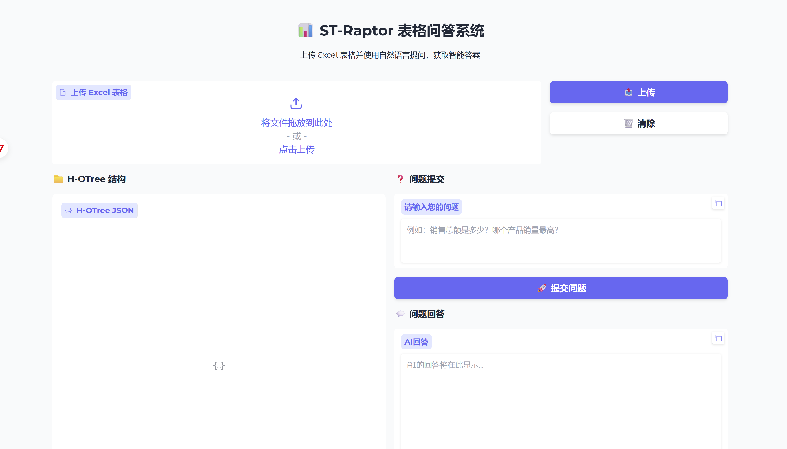

# ST-Raptor

<p align="center">
  
</p>

<div align="center">
  <p>
    <b>
      <a href="README.md">English</a>
      |
      <a href="README.zh-CN.md">中文</a>
    </b>
  </p>
</div>

## 📣 近期更新

- [ ] 主要功能
  - [x] 支持LLM、VLM及嵌入模型的本地部署与API调用
  - [x] 支持多样化输入格式：HTML、CSV、MARKDOWN等
  - [ ] 支持图像输入
  - [ ] 扩展表格提取模块，支持问题定义之外的表格类型

- [ ] 基准测试数据集
  - [x] 更新中英文双版本SSTQA基准测试集
  - [ ] SSTQAv2版本即将发布！

- [ ] 可视化功能
  - [x] 支持基于Gradio的可视化平台
  - [ ] 支持通过Gradio进行超参数设置
  - [x] 支持HO-Tree结构可视化
  - [ ] 支持HO-Tree人工修正功能

## ✨ 项目介绍

ST-Raptor 是一款专为多样化半结构化布局表格问答而设计的工具。它仅需输入Excel格式的表格和自然语言问题，即可生成精确答案。

与许多现有方法不同，ST-Raptor无需额外微调。它结合了视觉语言模型（VLM）与树形构建算法（HO-Tree），并能灵活集成不同的大语言模型（LLM）。ST-Raptor采用双阶段验证机制，确保输出结果的可靠性。

## ❓ ST-Raptor 可以处理哪些表格？

<p align="center">
  
</p>

**诸如个人信息表格、学术表格、财务表格等复杂半结构化表格，支持Excel、HTML、Markdown、csv等格式。**

## 💻 SSTQA 基准测试数据集

SSTQA数据集中的102张表格和764个问题，是从2031张真实场景表格中经过双重标准精心筛选而成：$(i)$ 选择具有半结构化特征的表格（如包含嵌套单元格、多行列标题、非常规布局等）$(ii)$ 确保覆盖19类代表性现实场景。

SSTQA包含 **102** 张表格以及 **764** 个问题。这些表格从 **2031** 张来自真实场景中的表格筛选并构建，并考虑了 $(i)$ 包含复杂结构的表格，例如嵌套单元格、多级标题、不规则的布局等 $(ii)$ 覆盖了 **19** 个代表性的真实场景。

以下是10类典型的现实场景示例：

人力资源、企业管理、财务管理、市场营销、仓储管理、学术研究、日程管理、申请表、教育相关以及销售管理。

您可在```./data```目录下获取SSTQA基准数据集：[SSTQA英文版]("./data/SSTQA-en") [SSTQA中文版]("./data/SSTQA-ch")

## 📊 框架效果

下表展示了不同方法在我们收集的SSTQA基准及其他两个基准测试中的回答准确率（%）与ROUGE-L得分对比。

需要说明的是，问答效果高度依赖于半结构化表格的复杂性和问题本身的复杂性。

## Baselines

NL2SQL methods: [OpenSearch-SQL](https://github.com/OpenSearch-AI/OpenSearch-SQL)

Fine-tuning based methods: [TableLLaMA](https://github.com/OSU-NLP-Group/TableLlama) [TableLLM](https://github.com/RUCKBReasoning/TableLLM)

Agent based methods: [ReAcTable](https://github.com/yunjiazhang/ReAcTable) [TAT-LLM](https://github.com/fengbinzhu/TAT-LLM)

Vision Language Model based methods: [TableLLaVA](https://huggingface.co/SpursgoZmy/table-llava-v1.5-13b) [mPLUG-DocOwl1.5](https://huggingface.co/mPLUG/DocOwl1.5)

Foudation Models: [GPT-4o](https://openai.com/index/gpt-4/) [DeepSeekV3](https://www.deepseek.com/)

## Experiment Results

| **Method**               | WikiTQ-ST        | TempTabQA-ST     |      SSTQA       |      SSTQA      |
| ------------------------ | ---------------- | ---------------- | :--------------: | :-------------: |
|                          | **Accuracy (%)** | **Accuracy (%)** | **Accuracy (%)** | **ROUGE-L (%)** |
| **NL2SQL (200 Samples)** |                  |                  |                  |                 |
| OpenSearch-SQL           | 38.89            | 4.76             |      24.00       |      23.87      |
| **Fine-tuning based**    |                  |                  |                  |                 |
| TableLLaMA               | 35.01            | 32.70            |      40.39       |      26.71      |
| TableLLM                 | 62.40            | 9.13             |       7.84       |      2.93       |
| **Agent based**          |                  |                  |                  |                 |
| ReAcTable                | 68.00            | 35.88            |      37.24       |      7.49       |
| TAT-LLM                  | 23.32            | 61.86            |      39.78       |      19.26      |
| **VLM based**            |                  |                  |                  |                 |
| TableLLaVA               | 20.41            | 6.91             |       9.52       |      5.92       |
| mPLUG-DocOwl1.5          | 39.80            | 39.80            |      29.56       |      28.43      |
| **Foundation Model**     |                  |                  |                  |                 |
| GPT-4o                   | 60.71            | 74.83            |      62.12       |      43.86      |
| DeepSeekV3               | 69.64            | 63.81            |      62.16       |      46.17      |
| **ST-Raptor**            | **71.17**        | **77.59**        |    **72.39**     |    **52.19**    |

<p align="center">
  
</p>

## 🕹 快速开始

#### 1. Clone 仓库

```shell
git clone git@github.com:weAIDB/ST-Raptor.git
cd ST-Raptor
```

#### 2. 部署环境 & Benchmark & 模型设置

**部署环境.**

1. 使用下面的指令来安装 ```conda``` 环境。

```bash
# create virtual environment
conda create -n straptor python=3.10
conda activate straptor
# install required packages
pip install -r requirements.txt
```

2. 安装 HTML 渲染工具```wkhtmltox ```以及字体包。

```shell
wget https://github.com/wkhtmltopdf/packaging/releases/download/0.12.6.1-2/wkhtmltox_0.12.6.1-2.jammy_amd64.deb
sudo apt-get install -f ./wkhtmltox_0.12.6.1-2.jammy_amd64.deb
sudo apt-get install -y fonts-noto-cjk fonts-wqy-microhei

```
**Benchmark**

1. SSTQA Benchmark存储在了 ```./data``` 文件夹中： [SSTQA-en]("./data/SSTQA-en") [SSTQA-ch]("./data/SSTQA-ch")
   - 您也可以在 HuggingFace 上访问 SSTQA Benchmark： [SSTQA Huggingface](https://huggingface.co/datasets/13515257315Tzr/SSTQA)
2. 修改在 ```./main.py``` 中的设定。

```python
# You need to change this
input_jsonl = 'PATH_TO_YOUR_INPUT_JSONL'      # The QA pairs
table_dir = 'PATH_TO_YOUR_TABLE_DIR'          # The corresponding tables
pkl_dir = 'PATH_TO_YOUR_PKL_DIR'              # The directory to store HO-Tree object files 
output_jsonl = 'PATH_TO_YOUR_OUTPUT_JSONL'    # The QA results
log_dir = 'PATH_TO_YOUR_LOG_DIR'              # The directory to store log files
```

QA 数据是以 JSON 的格式保存的，以下是其格式。
```json
{
	"id": "XXX", 
	"table_id": "XXX", 
	"query": "XXX", 
	"label": "XXX"    // Optional when inference
}
```

**模型设置.**
本文的模型配置包括Deepseek-V3（LLM API）+InternVL2.526B（VLM）+Multilingule-E5-Large-Instruct（嵌入式模型）。此配置总共需要大约160GB的GPU内存。您可以根据硬件情况替换模型，也可以将其更改为使用API。

您需要更改在 ```./utils/constnts.py``` 中的模型调用设置。

```python
"""Change this for requesting LLM"""
LLM_API_URL = "YOUR_LLM_API_URL"
LLM_API_KEY = "YOUR_LLM_API_KEY"
LLM_MODEL_TYPE = "YOUR_LLM_MODEL_TYPE" 

"""Change this for requesting VLM"""
VLM_API_URL = "YOUR_VLM_API_URL"
VLM_API_KEY = "YOUR_VLM_API_KEY"
VLM_MODEL_TYPE = "YOUR_VLM_MODEL_TYPE"

"""Change this for requesting Embedding Model"""
EMBEDDING_TYPE = "api" # api / local

## If EMBEDDING_TYPE is local
EMBEDDING_MODE_PATH = "YOUR_PATH_TO_MULTILINGULE_E5"

## If EMBEDDING_TYPE is api
EMBEDDING_API_URL = "YOUR_EMBEDDING_API_URL"
EMBEDDING_API_KEY = "YOUR_EMBEDDING_API_KEY"
EMBEDDING_MODEL_TYPE = "YOUR_EMBEDDING_MODEL_TYPE"
```

现在的 API 默认使用 OpenAI 调用格式，如果你需要修改为其他的调用方式，请参考 ```./utils/api_utils.py``` 文件。

使用本地部署的 VLM 以及 Embedding 模型作为一个部署示例。

首先 [下载 InternVL2.5](https://huggingface.co/OpenGVLab/InternVL2_5-26B) 以及 [下载 Multilingual-E5](https://huggingface.co/intfloat/multilingual-e5-large-instruct)

1. 安装 ```vllm``` 包.

```shell
pip install vllm
```

2. 指定 GPU 并部署 VLM。

```shell
CUDA_VISIBLE_DEVICES=0,1,2,3 python -m vllm.entrypoints.openai.api_server \
--model=PATH_TO_INTERNVL \
--served-model-name internvl
--port 8138 \
--trust-remote-code \
--max-num-batched-tokens 8192 \
--seed 42 \
--tensor-parallel-size 4
```

3. 在 ```./utils/constnts.py``` 文件中设置模型调用方式

```python
"""Change this for requesting LLM"""
LLM_API_URL = "YOUR_LLM_API_URL"        # [Change This]
LLM_API_KEY = "YOUR_LLM_API_KEY"        # [Change This]
LLM_MODEL_TYPE = "YOUR_LLM_MODEL_TYPE"  # [Change This]

"""Change this for requesting VLM"""
VLM_API_URL = "http://localhost:8000/v1/"
VLM_API_KEY = "Empty"
VLM_MODEL_TYPE = "internvl"

"""Change this for requesting Embedding Model"""
EMBEDDING_TYPE = "local" # api / local

## If EMBEDDING_TYPE is local
EMBEDDING_MODE_PATH = "YOUR_PATH_TO_MULTILINGULE_E5"  # [Change This]
```

#### 开始 QA !

如果您已经完成了上述所有设置，则可以运行以下代码执行您的 QA。

```shell
python ./main.py
```

#### 使用可视化平台

如果您想要使用我们搭建的可视化平台，则可以运行以下代码生成页面

```shell
python ./gradio_app.py
```
如果服务正常启动，您可以在浏览器中打开这样的界面

<p align="center">
  
</p>

您可以在这个界面中上传表格，查看该表格生成的H-O Tree的结构，并针对这个表格向我们的模型提问！

## 💡 半结构化表格 QA 示例

|                           Question                           | Ground Truth                                                 | TableLLaMA                                                   | TableLLM                                                     | ReAcTable                                                    | TAT-LLM                                                      | TableLLaVA                                                   | mPLUG-DocOwl1.5                                              | DeepseekV3                                                   | GPT-4o                                                       | ST-Raptor                                                    |
| :----------------------------------------------------------: | ------------------------------------------------------------ | ------------------------------------------------------------ | ------------------------------------------------------------ | ------------------------------------------------------------ | ------------------------------------------------------------ | ------------------------------------------------------------ | ------------------------------------------------------------ | ------------------------------------------------------------ | ------------------------------------------------------------ | ------------------------------------------------------------ |
| What is the value of the employment service satisfaction indicator in the overall budget performance target table for municipal departments in 2024? | ≧90%                                                         | 75.0                                                         | 737                                                          | ≧95%                                                         | ≧90%                                                         | 80%                                                          | ≧90%                                                         | ≧90%                                                         | ≧90%                                                         | ≧90%                                                         |
|   How many items are there in the drawing specifications?    | 15                                                           | 2                                                            | To change the template, you can follow these steps: ...      | 7                                                            | 108                                                          | 17                                                           | 4                                                            | 15                                                           | 23                                                           | 15                                                           |
|  How many status codes are there in the status code table?   | 3                                                            | 3                                                            | To change the template, you can follow these steps: ...      | 7                                                            | 5                                                            | 33                                                           | 3                                                            | 3                                                            | 4                                                            | 3                                                            |
|       Which month had the lowest expenditure in 2020?        | February                                                     | Travel expenses                                              | To find the total expenditure amount in June 2019 ...        | June 5th                                                     | ""                                                           | June 5th                                                     | Long Boat Festival welfare                                   | February                                                     | January                                                      | February                                                     |
| How many sales records did the brand "Tengyuan Mingju" have in June? | 7                                                            | 3                                                            | ""                                                           | 7                                                            | ""                                                           | 13                                                           | 5                                                            | 7                                                            | 8                                                            | 7                                                            |
| What was the business hospitality expense of the Comprehensive Management Office in February? | 5106.36                                                      | 5106.36                                                      | ""                                                           | ""                                                           | SELECT SUM(`Amount incurred`) FROM DF WHERE `Project Content` = 'Business entertainment expenses' ... | 3500                                                         | 130,168                                                      | 5106.36                                                      | 5106.36                                                      | 5106.36                                                      |
| What is the proposed funding for the social insurance gap and living allowance for college graduates under the \"Three Supports and One Assistance\" program? | 587.81 million yuan                                          | 587.81                                                       | To find the number of financially supported personnel ...    | To find the proposed investment amount for the social insurance gap and living allowance ... | 587.81                                                       | 1.2 billion                                                  | 1140                                                         | 587.81                                                       | 587.81                                                       | 587.81                                                       |
| What is the target value for the number of new urban employment in the 2024 Municipal Department Overall Budget Performance Target Table? | 50000 people                                                 | 50000                                                        | To find the number of financially supported personnel in...  | The question asks for the indicator value for the number of new urban employment ... | 50000                                                        | 1484                                                         | 50000                                                        | 50000                                                        | 50000                                                        | 50000                                                        |
| How many first-level indicators are there in the performance metrics? | 3                                                            | 10                                                           | 10                                                           | 10                                                           | 10                                                           | 100                                                          | 2                                                            | 3                                                            | 4                                                            | 3                                                            |
| How many third-level indicators are there in the quantity indicators of the performance metrics? | 4                                                            | 2                                                            | To change the template, you can follow these steps: ...      | To determine how many information items in the information item comparison... | 12#13#14#15#16#17#18#19#20#21#22#23#24#25#26#27#28#29#30...  | 108                                                          | 4                                                            | 8                                                            | 3                                                            | 8                                                            |
| How many points are deducted each time for disciplinary violations? | 0.5                                                          | 0.5                                                          | 0.5                                                          | 0.5                                                          | 0.5 points                                                   | For each violation of discipline, 10% of the employee's base salary will be deducted. | 0.5 points                                                   | 0.5                                                          | 0.5                                                          | 0.5                                                          |
| How many evaluation items are there for technical management in the key performance review indicators? | 9                                                            | 15                                                           | The item with the highest standard score in the basic performance evaluation indicators is  ... | 7                                                            | 16                                                           | 10                                                           | 4                                                            | 0                                                            | 10                                                           | 0                                                            |
| Has the fire safety approval process been completed for the area covered by this tender? | Already registered, provided                                 | already applied for and provided                             | completed for the bidding area                               | The item with the highest standard score in the basic performance... | ""                                                           | The fire protection application procedure has been completed for the bidding area. | Yes                                                          | Construction reported and provided                           | The fire protection application has been completed.          | Construction reported, provided                              |
| How many responsible departments are involved at the construction site? | 1                                                            | 2                                                            | To determine the employee with the longest tenure in the table, ... | 10                                                           | 11                                                           | 22                                                           | 2                                                            | 1                                                            | 1                                                            | 1                                                            |
|     What is the total financial expense for all months?      | 1312                                                         | 6500                                                         | 5635559.66                                                   | ""                                                           | 64800.0                                                      | 4300000                                                      | 5502                                                         | 1412                                                         | 1412                                                         | 1412                                                         |
| Who is responsible for sealing the reserved holes and sleeves of fire protection facilities and equipment? | winning bidder                                               | winning bidder                                               | ""                                                           | To answer the question \"Who is responsible for sealing the reserved ... | ""                                                           | fire department                                              | the manufacturer                                             | winning bidder                                               | The winning bidder is responsible.                           | winning bidder                                               |
|     Which two products had sales exceeding 3800 in June?     | Potato chips, Soy milk                                       | Potato chips, Soy milk                                       | To find the sales volume of soy milk in June, we             | SQL: ```SELECT `product name`, June FROM DF WHERE June > 3800;```.... | Potato chips                                                 | In June, the sales of the two products were 3800 and 4200.   | Potato chips, Soy milk                                       | Potato chips, Soy milk                                       | Potato chips, Soy milk                                       | Potato chips, Soy milk                                       |
| How many times is the sales volume of soy milk in May compared to the sales volume of potato chips in May? | 1.32                                                         | 2.06667                                                      | 5000                                                         | 1.32                                                         | 0.27778                                                      | 1.046154                                                     | 2.2                                                          | 1.32                                                         | 1.32                                                         | 1.32                                                         |
| How much did the sales volume of glucose increase in February compared to January? | 350                                                          | 1150                                                         | 5000                                                         | 350                                                          | 350                                                          | 2300                                                         | 100                                                          | 350                                                          | 350                                                          | 350                                                          |
| Which month has the highest sales volume of nutritious oat cereal? | June                                                         | May                                                          | June                                                         | June                                                         | June                                                         | March                                                        | June                                                         | June                                                         | June                                                         | June                                                         |
|        What was the sales volume of soy milk in June?        | 5000                                                         | 5000                                                         | 5000                                                         | 5000                                                         | 5000                                                         | 1150                                                         | 5000                                                         | 5000                                                         | 5000                                                         | 5000                                                         |
|      How many items are there in the specific project?       | 10                                                           | 1                                                            | The specific contents of determining the cost calculation object... | 1                                                            | 10                                                           | 19                                                           | 10                                                           | 10                                                           | 12                                                           | 10                                                           |
| What is the description for the "Reported" status in the status code table? | Change coordination, review feasibility by the Change Advisory Board. | The Change Coordination Change Advisory Committee conducts a feasibility review. | To change the template, you can follow these steps:          | The table provided does not contain any information about the "declared" status in the change status code table. | The Change Coordination Change Advisory Committee conducts a feasibility review. | The "declared" status is used to indicate that a change has been declared but not yet implemented. | The Change Coordination Advisory Committee conducts a feasibility review. | Change coordination Change Advisory Board conducts feasibility review. | Change coordination Change Advisory Board conducts feasibility review. | Change coordination Change Advisory Board conducts feasibility review. |
| What is the description related to information security requirements in the table of change reasons? | Information security related management is required          | Information security related management needs                | To change the template, you can refer to the "Change Template" row in the table. | ""                                                           | Information security related management needs                | The change reason table includes information security needs, which are related to the change request. | Information security relates to the management needs         | Information security related management requirements         | Information security related management requirements         | Information security related management requirements         |
|        What was the sales volume of glucose in March?        | 1150                                                         | 1150                                                         | 5000                                                         | 1150                                                         | 1150                                                         | 1800                                                         | 1150                                                         | 1150                                                         | 1150                                                         | 1150                                                         |
|    What is the number of new urban employment positions?     | 12，790，000 people                                          | 1279.0                                                       | 1279                                                         | 1279                                                         | 1279                                                         | 1000 people                                                  | 1279                                                         | 1279                                                         | 12,79 million people                                         | 1279                                                         |
| How many entries are there in the table of reasons for change? | 10                                                           | 3                                                            | To change the template, you can follow these steps: ...      | To determine how many reasons in the change reason table involve business... | 3                                                            | 10                                                           | 4                                                            | 1                                                            | 10                                                           | 1                                                            |
|  How many phases are there in the change phase code table?   | 6                                                            | 4                                                            | To change the template, you can follow these steps ...       | 55                                                           | 5                                                            | 17                                                           | 4                                                            | 6                                                            | 6                                                            | 6                                                            |
| What is the description of the change closure phase in the change phase code table? | Change closed and archived                                   | Change closure phase is the last phase of the change management process | To change the template, you can follow these steps:          | The table provided does not contain any information about the "change closure phase" or its description. | Change closure and archiving                                 | The change closure phase is a change phase that is used to indicate that the change has been completed | Change closure and archiving                                 | Change closed and archived                                   | Change closed and archived                                   | Change closed and archived                                   |
| How many more participants are enrolled in the basic old-age insurance for urban and rural residents than in the basic old-age insurance for urban employees at the end of the period? | 9745.25 million people                                       | 53046.1618                                                   | 1279                                                         | 9745.2486                                                    | 9745.2486                                                    | 10000                                                        | 200000                                                       | 9745.2486                                                    | 9745.2486                                                    | 9745.2486                                                    |
| What is the percentage of unemployment insurance fund expenditure out of its fund revenue? | 96.53%                                                       | 0.023256                                                     | 1279                                                         | 95.76%                                                       | 0.96911                                                      | 55.56                                                        | 33%                                                          | 96.53                                                        | 96.53%                                                       | 96.53                                                        |
| What is the total number of urban unemployed individuals who have found employment again and the number of individuals with employment difficulties who have found employment in employment and reemployment programs? | 668                                                          | 254                                                          | 1279                                                         | 668                                                          | 668                                                          | 10000                                                        | 584                                                          | 668                                                          | 668                                                          | 66                                                           |

*注意: 内容为 "" 的单元格代表 Baseline 执行该问答失败。*

完整的结果请参考: [baseline_output.jsonl](./static/baseline_output.jsonl)

# 📍 Citation

如果您对本项目感兴趣，请引用我们的论文 [link](https://arxiv.org/abs/2508.18190):

```
@article{tang2026straptor,
  author       = {Zirui Tang and Boyu Niu and Xuanhe Zhou and Boxiu Li and Wei Zhou and Jiannan Wang and Guoliang Li and Xinyi Zhang and Fan Wu},
  title        = {ST-Raptor: LLM-Powered Semi-Structured Table Question Answering},
  journal      = {Proc. {ACM} Manag. Data},
  year         = {2026}
}
```

# 👨‍🏫 加入我们 !

ST-Raptor@Complex Semi-Structured Table Analysis Community  (WeChat)

ST-Raptor@复杂半结构表格分析社区 (微信群)

<p align="center">
  
</p>


## 📝 License

This project is licensed under the MIT License - see the [LICENSE](LICENSE) file for details

